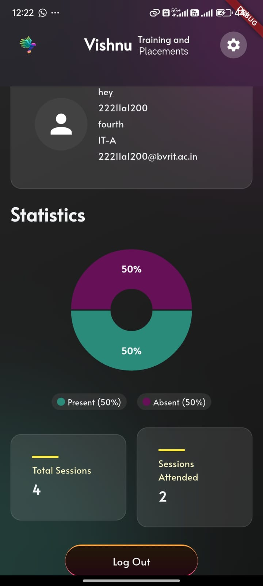
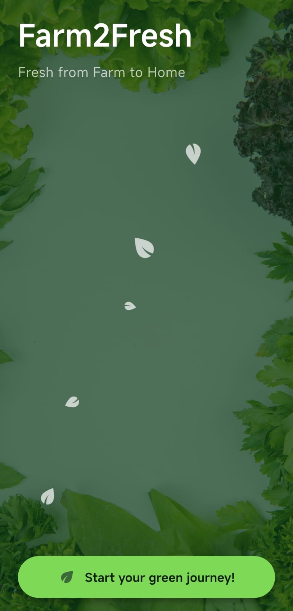
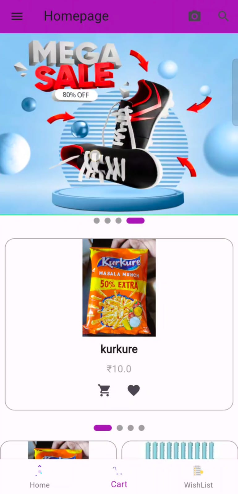

  

###

<h1 align="center">👋 Hey, I'm Suddala Shashank</h1>

###

  

###

<h4 align="center">A passionate Flutter & Full Stack App Developer | Software Engineer Enthusiast  I focus on crafting efficient, scalable solutions with strong expertise in both frontend and backend development. I'm always eager to learn new technologies, adapt quickly, and thrive in fast-paced environments where innovation and problem-solving lead to meaningful impact.</h4>

###

  
  

###

<h3 align="left">👩‍💻  About Me</h3>

###

🚀 Passionate Java and Flutter Developer focused on building scalable backend systems, mobile apps, and cloud-based solutions  🔭 Currently working on real-world projects using Flutter and exploring Spring Boot microservices, AI/ML, and real-time development  💬 Skilled in App Development, Workflow Management, OOPs, and Backend Architecture  🌐 Open to internships, collaborations, and impactful open-source contributions  ⚡ A technophile who loves turning real-world problems into working solutions through code

###

<h2 align="left">💻 Tech Stack:</h2>

<table>
  <thead>
    <tr>
      <th><strong>Category</strong></th>
      <th><strong>Technologies</strong></th>
    </tr>
  </thead>
  <tbody>
    <tr>
      <td><strong>Languages</strong></td>
      <td>
        
        
        
        
        
      </td>
    </tr>
    <tr>
      <td><strong>Frontend</strong></td>
      <td>
        
        
        
        
      </td>
    </tr>
    <tr>
      <td><strong>Backend & Cloud</strong></td>
      <td>
        
        
        
        
      </td>
    </tr>
    <tr>
      <td><strong>Database</strong></td>
      <td>
        
        
        
      </td>
    </tr>
    <tr>
      <td><strong>CI/CD & Tools</strong></td>
      <td>
        
        
        
        
      </td>
    </tr>
   <tr>
  <td><strong>Other Tools</strong></td>
  <td>
    
    
    
  </td>
</tr>

  </tbody>
</table>

###

<h3 align="left">🛠️ Projects</h3>

###

<table width="100%">
  <tr>
    <!-- Project 1 -->
    <td width="33.3%" valign="top">
      <h3 align="center"><a href="https://github.com/Shashank250705/Vishnu-Training-Placement">📱 BVRIT Placement App</a></h3>
      

        
      

      

        <strong>Tech Stack:</strong>
         
        
        
        
        
      

      

        <strong>Key Features:</strong>
        <ul>
          <li>📅 Training & placement schedules</li>
          <li>⚡ Real-time updates</li>
          <li>🔑 Student & admin access</li>
          <li>📱 Responsive Android app</li>
        </ul>
      

      

        
      

    </td>
    <!-- Project 2 -->
    <td width="33.3%" valign="top">
      <h3 align="center"><a href="https://github.com/Shashank250705/F2F">🛒 Farm2Fresh</a></h3>
      

        
      

      

        <strong>Tech Stack:</strong>
         
        
        
        
        
      

      

        <strong>Key Features:</strong>
        <ul>
          <li>🌱 Fresh produce marketplace</li>
          <li>💳 Secure payments</li>
          <li>📍 Order tracking</li>
          <li>🤝 Farmer-to-consumer direct</li>
        </ul>
      

      

        
      

    </td>
    <!-- Project 3 -->
    <td width="33.3%" valign="top">
      <h3 align="center"><a href="https://github.com/Shashank250705/smart-cart-ss--">⚡ Smart Cart</a></h3>
      

        
      

      

        <strong>Tech Stack:</strong>
         
        
        
        
        
      

      

        <strong>Key Features:</strong>
        <ul>
          <li>🔍 Instant QR & Barcode scanning</li>
          <li>🛒 Dynamic cart & total estimation</li>
          <li>💳 Seamless digital checkout</li>
          <li>📊 Smart list management</li>
        </ul>
      

      

        
      

    </td>
  </tr>
</table>

###

<h3 align="left">🔥 GitHub Profile Summary Cards</h3>

###

  
  

  
  
  

###
